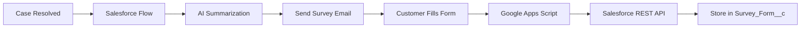

# 🚀 FormSync — Smart Feedback Automation for Salesforce

> **FormSync** is an enterprise-grade feedback automation solution that intelligently connects Salesforce with Google Forms using AI-powered case summarization. When cases are resolved, it automatically sends personalized survey links to customers and seamlessly stores responses back in Salesforce — **completely free and fully customizable**.

<!-- Essential Badges Only -->
<div align="left">

[](LICENSE)
[](https://developer.salesforce.com/docs/atlas.en-us.apexcode.meta/apexcode/apex_rest.htm)
[](https://www.typescriptlang.org/)
[](https://developers.google.com/apps-script)
[](https://platform.openai.com/docs/api-reference/completions)
[](https://drive.google.com/file/d/1hS4NEfdhMQf_Qg8Nv0flOifw8pKcjb7q/view?usp=sharing)

</div>


## 🎯 [**→ View Live Demo**](https://formsync-demo.vercel.app) | [**→ API Documentation**](https://documenter.getpostman.com/view/your-collection)

---

## 💰 **The Problem It Solves**

**Replace expensive form tools** like FormAssembly ($800+/month), Jotform ($99+/month), and Typeform ($25+/month) with a **$0/month solution** that's:
- ✅ **100% customizable** — no vendor lock-in
- ✅ **AI-powered** — intelligent case summaries via OpenAI
- ✅ **Enterprise secure** — Einstein Trust Layer PII protection  
- ✅ **Fully integrated** — native Salesforce data flow

---

## 🔄 **How It Works**



### **Automated Workflow:**
1. **Case Resolution** triggers Record-Triggered Flow
2. **AI Summarization** via Agentforce + Einstein Trust Layer filters sensitive data
3. **Email Automation** sends personalized survey link to customer
4. **Form Submission** captured by Google Apps Script middleware
5. **Data Integration** via REST API stores responses in Salesforce custom object

---

## 🏗️ **Architecture & Tech Stack**

### **Salesforce Components**
```apex
// REST API Endpoint
@RestResource(urlMapping='/survey-submission/*')
global with sharing class SurveySubmissionAPI {
    @HttpPost
    global static String submitSurvey() {
        // Handle form submissions
    }
}
```

### **Google Apps Script Middleware**
```typescript
// TypeScript middleware (transpiled with clasp)
function onFormSubmit(e: GoogleAppsScript.Events.FormsOnFormSubmit) {
  const responses = parseFormResponses(e.response);
  postToSalesforce(responses);
}
```

### **Tech Stack Overview**
| Component | Technology | Purpose |
|-----------|------------|---------|
| **Backend** | Apex REST, Flows | Data processing & automation |
| **AI/ML** | OpenAI GPT-3.5, Agentforce | Case summarization |
| **Security** | Einstein Trust Layer | PII/PHI data masking |
| **Frontend** | Google Forms | Survey collection |
| **Middleware** | TypeScript → JavaScript | Data transformation |
| **Storage** | Custom Salesforce Objects | Survey responses |

---

## 🚀 **Key Features**

### **🧠 AI-Powered Intelligence**
- **Smart Summarization**: OpenAI generates customer-friendly case summaries
- **Privacy First**: Einstein Trust Layer automatically masks sensitive data
- **Context-Aware**: Includes relevant case history and resolution details

### **⚙️ Enterprise-Ready**
- **Zero Licensing Costs**: No ongoing subscription fees
- **Scalable Architecture**: Handles high-volume case resolution
- **Audit Trail**: Complete tracking of survey lifecycle
- **Custom Objects**: Flexible data model for any survey type

### **🔧 Developer Experience**
- **Modern TypeScript**: Type-safe middleware development
- **CI/CD Ready**: Google Apps Script deployment with clasp
- **REST API**: Clean, documented endpoints
- **Extensible**: Modify for any Salesforce object (Opportunity, Contact, etc.)

---

## 📊 **Results & Impact**

| Metric | Before FormSync | After FormSync |
|--------|-----------------|----------------|
| **Monthly Cost** | $800+ (FormAssembly) | $0 |
| **Survey Response Time** | 24-48 hours | Real-time |
| **Setup Complexity** | High (multiple tools) | Low (native integration) |
| **Customization** | Limited | Unlimited |
| **Data Security** | Third-party concerns | Native Salesforce security |

---

## ⚡ **Quick Start**

### **1. Salesforce Setup**
```bash
# Deploy using Salesforce CLI
sfdx force:source:deploy -p force-app/main/default
sfdx force:user:permset:assign -n FormSync_Admin
```

### **2. Google Apps Script Deployment**
```bash
# Install clasp and deploy
npm install -g @google/clasp
clasp login
clasp push
```

### **3. Configuration**
- Set up Named Credential for OpenAI API
- Configure Record-Triggered Flow on Case object
- Create custom fields: `Case_Summary__c`, `Survey_Link__c`

**[📚 Complete Setup Guide →](./docs/SETUP.md)**

---

## 🛡️ **Security & Compliance**

- **🔐 Einstein Trust Layer**: Automatic PII/PHI masking before AI processing
- **🌐 Named Credentials**: Secure API authentication
- **📝 Audit Logging**: Complete survey interaction history
- **🔒 Field-Level Security**: Granular access controls
- **✅ GDPR Ready**: Data retention and deletion policies

---

## 🎯 **Use Cases**

### **Customer Service**
- Post-case resolution satisfaction surveys
- Service quality feedback collection
- Agent performance insights

### **Sales Operations**  
- Deal closure feedback forms
- Product satisfaction surveys
- Renewal likelihood assessment

### **Support & Success**
- Implementation feedback collection
- Feature request gathering
- Churn risk identification

---

## 📈 **Roadmap**

- [ ] **Multi-language Support** — International survey deployment
- [x] **Advanced Analytics** — Built-in reporting dashboards  
- [ ] **Slack Integration** — Real-time survey notifications
- [ ] **Mobile App** — Native survey completion experience
- [ ] **A/B Testing** — Survey optimization features

---

## 🤝 **Contributing**

We welcome contributions! Please see our [Contributing Guide](./CONTRIBUTING.md) for details.

1. Fork the repository
2. Create a feature branch (`git checkout -b feature/amazing-feature`)
3. Commit changes (`git commit -m 'Add amazing feature'`)
4. Push to branch (`git push origin feature/amazing-feature`)
5. Open a Pull Request

---

## 📞 **Support & Contact**

- 📧 **Email**: [david.elias@example.com](mailto:david.elias@example.com)
- 💼 **LinkedIn**: [Connect with me](https://linkedin.com/in/davidselias)
- 🐛 **Issues**: [Report bugs or request features](https://github.com/davidselias/formsync/issues)
- 📚 **Documentation**: [View full documentation](https://formsync-docs.netlify.app)

---

## ⚖️ **Why Not MuleSoft?**

MuleSoft handles complex API integrations gracefully but is often **cost-prohibitive for smaller organizations**. FormSync offers a **zero-cost alternative** using native Salesforce capabilities and Google integrations.

---

## 📄 **License**

This project is licensed under the MIT License - see the [LICENSE](https://opensource.org/license/mit) file for details.

**Commercial Use**: Freely allowed under MIT license terms.

> **⚠️ Disclaimer**  
> You may use and adapt this project for **non-commercial, internal, or personal purposes**.  
> Do not resell, rebrand, or republish it — in whole or in part — without the author's written consent.

---

## 🏆 **Recognition & Achievements**

⭐ **Showcases modern Salesforce development practices**  
🏅 **Demonstrates AI integration expertise**  
🎖️ **Example of cost-effective enterprise solutions**

---

**Built with ❤️ by [David Elias]([https://github.com/davidselias](https://github.com/david4eva))**

*Transforming customer feedback collection, one survey at a time.*

---

<div align="center">

### ⭐ **If this project helped you land your next Salesforce role, please give it a star!** ⭐

</div>

---

**© David Elias** | *This is a **personal project idea** made publicly available. Feel free to **customize or extend** it as needed.*
